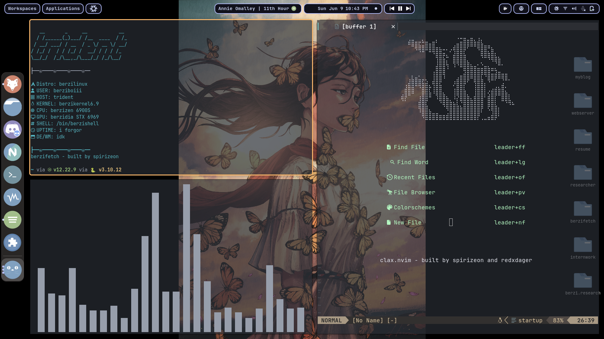

## About Me

### Hi! I'm Ayush Dutta. 
I work at the intersection of software development, systems security & reverse engineering focussing on Nix-based (Linux, Mac & BSD) operating systems. I also have a keen interest in DevOps, core machine learning, FOSS and other concepts surrounding tech.

**I have travelled to cities such as Kolkata, Patna, Guwahati and Vijaywada (current) for work/studies.**

## Stuff I write about

1. [NixOS:OS as Code](./blogposts/nixos.md)
2. [Uniqueness of Arch Linux](./blogposts/arch.md)
3. [Virtual Machines and Containers](./blogposts/vms.md)
4. [Web Pen-testing strategies](./blogposts/wap.md)
5. [Setting-up malware development Lab](./blogposts/mal.md)

See more on [Blogs](./blogs)

> Checkout this cool screenshot i took!

## Professional life

### Summer Intern - BITS Pilani, Hyderabad
- Research project on Wireless Crowd Charging Algorithms
- Contributing by benchmarking network algorithms

### Associate - Next Tech Lab AP, Amaravati
- Independent development & research
- Analysing malware and researching web app security

### Mentor - GDSC IIT Madras 
- Founded and grew a Linux community from 0 to 330+ in 90 days
- Completed GenAi study jam among top 60
- Spoke in seminars about [Linux](https://gdsc.community.dev/events/details/developer-student-clubs-indian-institute-of-technology-iit-chennai-presents-dumping-windows-welcome-to-linux/) and [Git+Github](https://gdsc.community.dev/events/details/developer-student-clubs-indian-institute-of-technology-iit-chennai-presents-versioning-visions-git-github-amp-beyond/)

--- 

## Interests and Tools

I'm passionate about stuff like low level programming, systems engineering, and cybersecurity

+ Git, Github, Docker, Linux
+ x86ASM, Bash, SQL 
+ Python3, C, x86_ASM, Lua 

## Some Projects

Here's a list of my recent personal projects i built in my free time.

+ **[berzifetch](https://github.com/spirizeon/berzifetch)**: System fetch written in C, faster and lighter replacement to Neofetch
+ **[clax.nvim](https://github.com/spirizeon/clax.nvim)**: Portable neovim distribution written in Lua & Bash, minimal, extensible and easy to setup
+ **[bersh](https://github.com/spirizeon/bersh)**: POSIX shell program aimed to replace Bash, Zsh/Fish, written in C
+ **[dialga (in progress)](https://github.com/spirizeon/dialga)**: Reverse-engineered Git, lighter, and faster.

