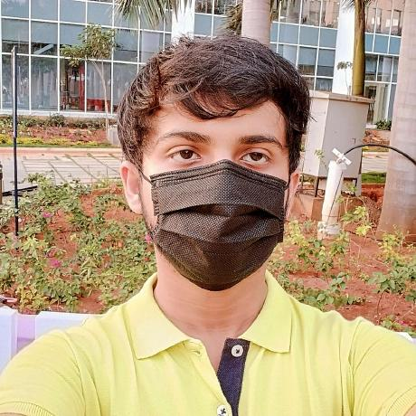

## About Me

Hi! I'm an upcoming sophomore year student of B.Tech  in SRM University, Andhra Pradesh

## Professional life

Org. | Role | Tasks
-----|-------|--------
Research (Stealth) | Summer Intern | Benchmarking algorithms
NextTechLabAP | Infosec Associate | Researching malware analysis
GDSC IIT Madras | Mentor | Seminars on [Linux](https://gdsc.community.dev/events/details/developer-student-clubs-indian-institute-of-technology-iit-chennai-presents-dumping-windows-welcome-to-linux/) and [Git+Github](https://gdsc.community.dev/events/details/developer-student-clubs-indian-institute-of-technology-iit-chennai-presents-versioning-visions-git-github-amp-beyond/)

--- 

## Stuff I write about

1. [NixOS:OS as Code](./blogposts/nixos.md)
2. [Uniqueness of Arch Linux](./blogposts/arch.md)
3. [Virtual Machines and Containers](./blogposts/vms.md)
4. [Web Pen-testing strategies](./blogposts/wap.md)
5. [Setting-up malware development Lab](./blogposts/mal.md)

See more on [Blogs](./blogs)

## Interests and Tools

I'm passionate about stuff like low level programming, systems engineering, and cybersecurity

+ Automation & DevOps: Git, Github, Docker, Actions
+ Security Research: IDA, PEstudio, Wireshark, x64DBG
+ Languages: Python3, C, x86_ASM, Bash, Lua 
+ OS: Riced PopOS (Ubuntu Fork by System76)

> Checkout this cool screenshot i took!

